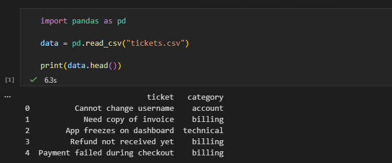
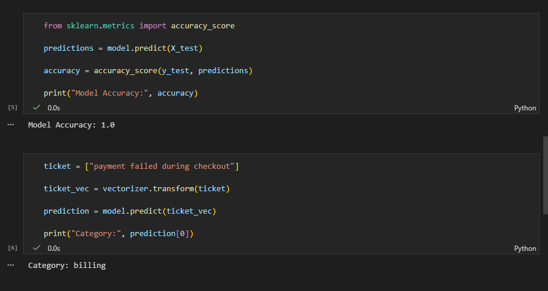
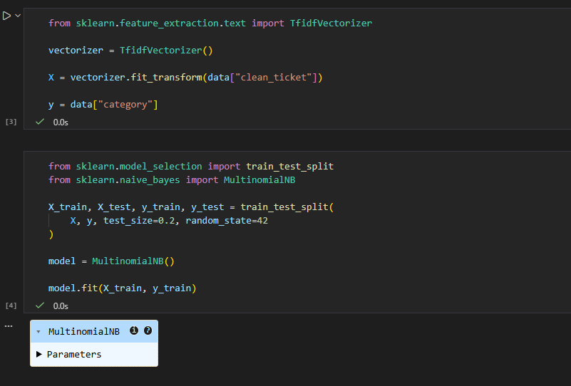
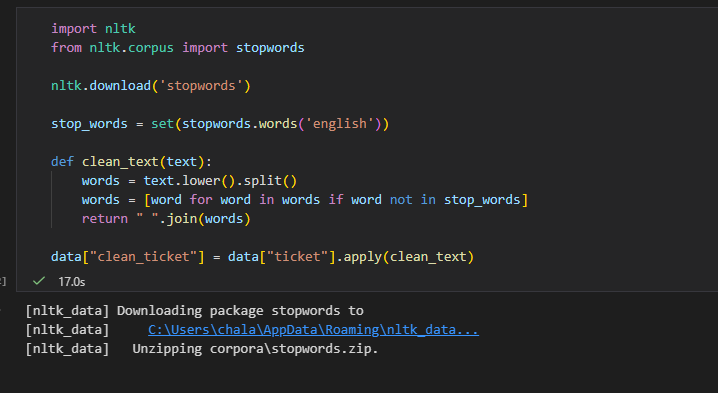
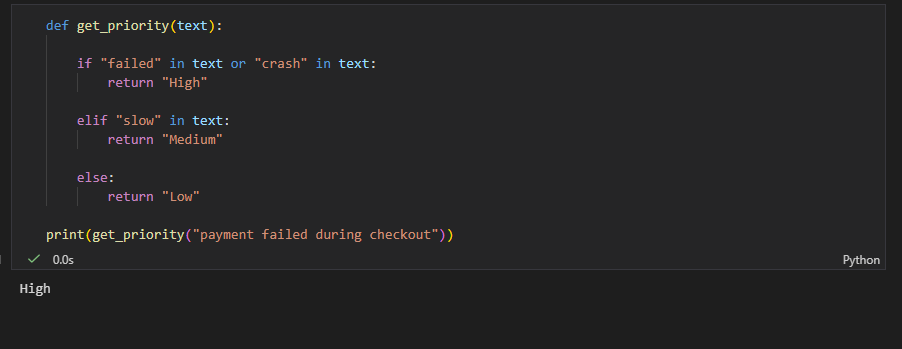

# FUTURE_ML_02
Support Ticket Classification using NLP

This project automatically classifies customer support tickets into categories and assigns priority levels.

Technologies Used
Python
NLTK
Scikit-learn
TF-IDF

Features
Text preprocessing
Ticket classification
Priority tagging
Model evaluation

## Screenshots

### Dataset Preview

### Model Accuracy

### Ticket Training

### Ticket Preprocessing

### Priority Tagging

